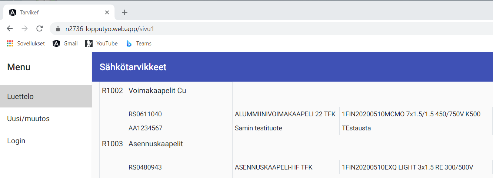

# Tarvike lopputyö

## 1 Yleisesittely

### Sovelluksen idea

> Alkuperäinen tarkoitus oli tehdä tutulle sähköurakoitsijalle hänen työtään helpottava sovellus. Tämän sovelluksen tarkoituksena oli, että hän voi helposti hallita eri urakoissa tarvittavien tai käytettyjen tarvikkeiden (=komponenttien) määriä urakan eri vaiheissa. Eli sovellus olisi eräänlainen muistilista/ostoslista, johon ensin arvioidaan sähköurakoissa mahdollisesti tarvittavat komponentit ja niiden määrät, johon sitten kirjataan toteutuneet ja josta lopuksi siirretään toteutuneet tiedot laskutukseen.
>
> Koska en viime syksyllä päivätyön muutoksien takia pystynytkään varaamaan riittävästi aikaa tämän suunnitelman toteuttamiseksi, karsin suunnitelmia ja tein tähän lopputyöhön pienen osasen tätä kokonaisuutta. Myöhemmin on tarkoitus jatkaa työtä laajentamalla sen toimintoja.
> Tässä lopputyössä eli Tarvike-sovelluksen osasessa voidaan luoda ja ylläpitää tietokantaan sähkötarvikkeiden tietoja muutamalle ryhmäkokonaisuudelle.

### Toiminnallisuus lyhyesti

> Sovelluksen idea on hyvin samankaltainen kuin Tommi Tuikan Nodejs-sovelluskehityskurssilla käyttämät Meanfront- ja Restapiexpress-esimerkit.
> Eli tässäkin sovelluksessa yhdellä välilehdellä näytetään kannan tämänhetkinen sisältö, yhdellä välilehdellä voidaan ylläpitää kannan tietoja kunhan ensiksi on kirjauduttu sisään kolmannen välilehden kautta.
>
> Olen esimerkin vuoksi tallentanut tietokantaan muutaman tarvikeryhmän. Näiden ryhmien alaisuuteen voidaan syöttää ja ylläpitää varsinaiset ryhmään kuuluvat komponentit. Muutama esimerkkikomponenttikin on tehty.
>
> Salasanojen ylläpitoa en ole kirjautumissivulle luonut. Testiä varten käyttäjätunnuksen ja salasanan saa minulta.

## 2 Kuvaus teknologioista

### Lyhyehkö kuvaus eri teknologioiden käyttämisestä työssä

> - Pääosin tekemiseen käytetty Angular versiota 11.
> - Tietokanta on tällä hetkellä mongodb joka pyörii MongoDBAtlas-palvelussa. Myöhemmin on tarkoitus vaihtaa MongoDB-kanta MySQL-tietokantaan (jolloin myös palvelualusta vaihtuu). Tietokannan käsittelyssä hyödynnetty mongoose-kirjastoja, jolloin myöhempi siirto kannasta toiseen onnistuu helpommin.
> - FrontEnd on julkaistu Firebase-pilvialustalle
> - BackEnd pyörii Heroku-pilvihostauspalvelussa. Backend:ssä on käytetty Expressiä ja RestAPIa.
> - Authorisoinnissa on käytetty JWT-tokenia.
> - Salasanat on kryptattu bcryptillä

### Työssä hyödynnetyt tutoriaalit

> Tässä lopputyössä on hyödynnetty lähes pelkästään Tommi Tuikan erinomaisia luennoilla käytettyjä esimerkkitehtäviä
> Käytetyt tutoriaalit:
>
> - HTG41108 Frontend -sovelluskehitys, Tommi Tuikka, luentotallenteet sekä tehtävät [7, 9]
> - HTG41110 Nodejs -sovelluskehitys, Tommi Tuikka, luentotallenteet sekä tehtävät [3, .. 7, 10]
> - HTG41109 Mobiilikehitys web-tekniikoilla, Tommi Tuikka, luentotallenteet sekä tehtävät 9 ja 10

### Komennot, joilla kehitysversion saa Githubista omalle koneelle toimimaan

> Kopiointi Githubista onnistuu parhaiten käyttäen Github-dokkareissa kerrottua seuraavaa ohjeatta: [Cloning a repository](https://docs.github.com/en/github/creating-cloning-and-archiving-repositories/cloning-a-repository).

## 3 Reflektio ja ajankäyttö

### Miten työ onnistui? Mikä oli helppoa, mikä vaikeaa?

> Työn suurimpia haasteita oli päivätyön muuttuneen työkuvan vaatima valtava työpanos syksyn aikana. Eli ajankohtana, jolloin alunperin olin suunnitellut tekeväni tämän lopputyön isommassa laajuudessaan, en pystynytkään kuin vain silloin tällöin panautumaan aiheeseen. Onneksi joulun alla tilanne päivätyön osalta rauhoittui niin, että pääsin kunnolla käsiksi tähän työhön.
>
> Aikataulun venyminen toi minulle suuria haasteita siinä, että opitut asiat unohtuivat. Vaan onneksi nämä opetukset oli videoitu. Ilman niiden kelaamista en olisi tästä lopputyöstä selvinnyt (näitä videoita onkin kelattu varmasti kymmeniä kertoja edestakaisin!).
>
> Oma haasteensa oli siinäkin, että yritin haukata alussa liian paljon eli tehdä aivan liian isoa ja hienoa lopputyötä. Näiden uusien asioiden opettelu vaatii kuitenkin paljon aikaa varsinkin minulta.
>
> Jos yksittäinen minulle haasteellinen kohta halutaan nostaa esiin, niin se oli Angularin ymmärtäminen. Ja siinä tarkemmin mainiten erityisesti oliorakenne, joka minulle oli vierasta ennen näitä kursseja.

### Kuinka paljon käytit aikaa loppuharjoitustyön tekemiseen?

> Paljon! Jo pelkästään tallenteet olen katsonut moneen kertaan läpi uudestaan ja uudestaan. Ja kun tallenteista frontend ja backend kursseista pelkästään kertyy yhteensä yli 50 tuntia katsottavaa ja muutakin materiaalia on netistä kaivettu niin kokonaisuudessa kulutin reilusti yli 150 tuntia tämän homman tekemiseen. Tarkkaa laskelmaa en valitettavasti tehnyt.

### Mitä tietoja/taitoja sinun tulee vielä kehittää?

> Angularin taitoja pitäisi yleensäkin kehittää. Suuria haasteita on tuonut ja tuo edelleenkin observablet sun muut olioihin liittyvät opettelut.
> Myös käyttäjälle näkyvän osuuden eli frontendin rakentelu on näköjään haasteellista. Näitä pitää siis kehittää ja niin aion myös tehdäkin.
